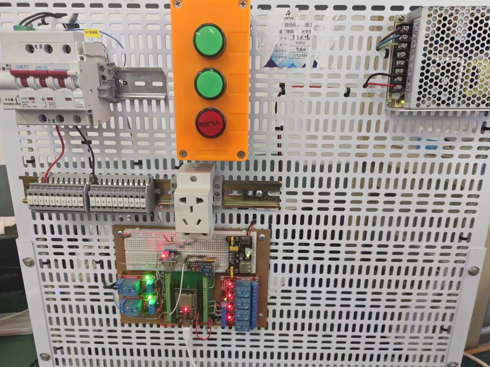

# 基于ESP32的物联网设备模拟


本程序用于模拟，下面这个基于ESP32,MQ-2,BH1750,BME280,断路器和四路继电器的物联网装置



## 硬件连接

无

## 通信备注

消息上报主题：见代码

消息上报格式：

```json
{
    "params": {
        "temperature": 20.92,
        "humidity": 55.47,
        "pressure": 1050,
        "lightIntensity": 66.66,
        "smokeDensity": 0.07,
        "relayStatus_1": 1,
        "relayStatus_2": 0,
        "relayStatus_3": 0,
        "relayStatus_4": 1,
        "circuitBreakerStatus": 1
    }
}
```


控制命令主题：见代码

控制命令格式：

```json
{
  "dalay_1": 1,
  "dalay_2": 0,
  "dalay_3": 0,
  "dalay_4": 1,
  "circuit_breaker":1
}
```
或:
```json
{
  "dalay_1": 1,
  "dalay_2": 0,
}
```
或:
```json
{
  "circuit_breaker":1
}
```
这样的格式，只会控制对应的继电器或断路器。


