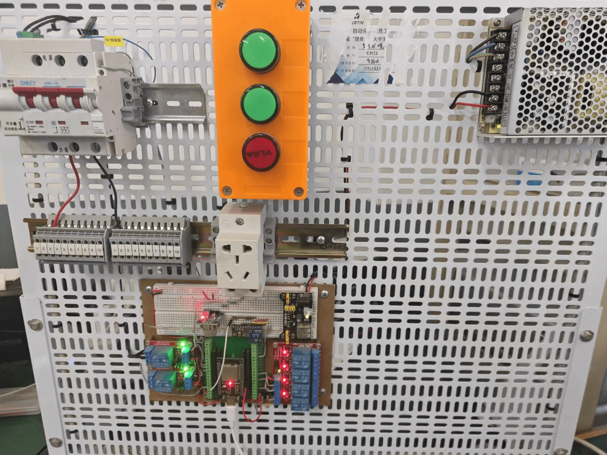

# EMQX Serverless 使用教程  

> [! INFO]  **前言：**  
> 本文档记录 EMQX Serverless 的基本使用、设备接入及相关配置内容。  
> 详细内容可参考：[EMQX Platform 文档](https://docs.emqx.com/zh/cloud/latest/price/plans.html)


## 一、基础：
### 1.1 EMQX Serverless 介绍  

EMQX Platform 为 MQTT 服务提供全面托管的环境以及 MQTT 服务的本地部署方案。EMQX Platform 提供以多个产品版本，包括按需计费的EMQX Serverless，面向企业用户的EMQX专有版，以及在专有版的基础上，增加了额外功能，支持复杂的企业应用的EMQX旗舰版。


本文档主要介绍Serverless版本的使用，下面是Serverless版本的一些特点：

- 按使用量计费：只需为实际使用付费，提供高达 100 万连接分钟的免费配额。
- 自动扩展：根据应用需求无缝扩展。
- 快速启动：非常适合开发者和小型项目。

下面Serverless的计费和免费规则：


Serverless版本每月 100 万免费连接分钟数，足以支持 23 台设备 30 天内 24x7 在线，对于我们小规模测试和使用完全足够，并且我们可以设置消费限额限制每月支出。如果将限额设置为 0 则意味着仅使用免费额度。当免费额度使用完，部署会自动停止，不会过多的扣除我们的费用（这点好评😁）。
### 1.2 EMQX Serverless部署

这部分参考： https://docs.emqx.com/zh/cloud/latest/create/serverless.html

文档十分详细，不再赘述，部署完成后如下图：


### 1.3 使用MQTTX连接平台

首先在客户端认证一栏添加用户（设备鉴权使用）


然后按照概览页的连接信息进行连接（用户名和密码必须按照自己设置的来）：


即可连接成功：


## 二、综合案例：使用小程序控制物联网设备

>[!INFO] 下面是一个综合案例：
>使用ESP32代表一般的物联网设备，使用基于uniapp开发的微信小程序来获取设备数据和控制设备，形成一个小的闭环。
>对应的代码仓库为：[ESP32-EMQX-MiniApp](https://github.com/XAUT-WisdomLab/ESP32-EMQX-MiniApp)
### 2.1 物联网设备

如下图，这是基于ESP32,MQ-2,BH1750,BME280,断路器和四路继电器的物联网模拟装置，用于模拟物联网设备。



可以采集温度、湿度、气压、烟感和控制四路继电器和一路断路器。

它上传数据的格式是这样的，顾名思义，这里就不详细介绍：

```json
{
	"params": {
		"temperature":	18.59,
		"humidity":	47.14,
		"pressure":	1038.11,
		"lightIntensity":	66.67,
		"smokeDensity":	0.15,
		"relayStatus_1":	1,
		"relayStatus_2":	0,
		"relayStatus_3":	0,
		"relayStatus_4":	1,
		"circuitBreakerStatus":	"0"
	 }
}
```

并且这个设备还可以接收MQTT消息，用来控制四路继电器和断路器，其接收数据的格式为：

```json
{
  "dalay_1": 1,
  "dalay_2": 0,
  "dalay_3": 0,
  "dalay_4": 1,
  "circuit_breaker":1
}
```

其中，控制项可缺省，比如这样

```json
{
  "dalay_1": 1,
  "dalay_2": 0,
}
```
也是可以的。

考虑到大家并没有具体的硬件设备，这里我提供一个用于模拟上述装置的ESP32程序，不依靠其他硬件，仅使用程序模拟采集数据（使用虚拟随机值），和被控制的过程（通过命令行打印控制信息）不需要连接硬件，只需要任意的开发板即可，如果手头没有开发板，我们也可以使用MQTTX手动接收和发送消息以模拟物联网设备。

>[!INFO] 为什么使用ESP32模拟物联网设备？
>虽然可以通过MQTTX模拟客户端设备，但是使用MQTTX只能模拟简单的消息发送和接收，不能灵活的在收发数据见添加处理逻辑，并且虽然ESP32模拟物联网设备并没有对接真实物理传感器，但是足够我们调试和学习ESP32的MQTT和云平台的通信，降低了在学习过程中因为硬件问题产生的阻碍。
>

克隆项目，并使用Vs Code打开：

```bash
git clone https://github.com/XAUT-WisdomLab/ESP32-EMQX-MiniApp.git
```


ESP32部分的代码在项目根目录的ESP32文件夹中，可以看到代码中的连接信息为空:


首先我们需要在EMQX平台为开发板添加鉴权信息：


然后在EMQX平台概览区域，找到AC证书并下载


拿下载好的证书替换ESP32工程目录下原有的`emqxsl-ca.crt`证书文件（注意文件名也需要是`emqxsl-ca.crt`）：


然后将对应的MQTT连接参数中输入到ESP32的程序中去，然后编译烧录程序即可：


这里的`MQTT_CLIENT_ID`随意填写，`MQTT_REPORT_TOPIC`是设备上报属性的主题，`MQTT_CONTROL_TOPIC`是用于控制设备的主题。

然后将ESP32代码烧录至开发板（具体如何烧录，请参考我的ESP32教程专栏），烧录成功后，开发板自动连接EMQX平台，若连接失败请检查参数是不是没写对，ESP32开始模拟上传数据：


平台端也可以看到ESP32已经成功连接：


### 2.2 微信小程序

接下来我们尝试运行小程序，接入EMQX平台，获取设备消息，和控制设备：

> [!INFO] 提示：
> 这里的小程序主要使用下列技术栈：
> - uni-app    —— 跨平台前端框架，支持多端编译。
> - vue3         —— 采用 Composition API，提高开发体验。
> - TS             —— 提供静态类型检查，增强代码可维护性。
> - uni-ui       —— uni-app 官方 UI 组件库，多端适配。
> - pinia         —— 轻量级状态管理
> - eslint+ prettier —— 代码规范工具，统一代码风格
>   
> 运行环境为Node.js 和微信开发者工具，请你事先安装Node.js 和微信开发者工具软件。

进入代码文件的App目录，使用`npm i`命令下载依赖（警告可无视，在此我们只做功能验证，不要在意细节）：


然后配置小程序里的MQTT连接参数，在`APP/src/utils/mqtt.ts`文件中修改连接参数，注意这里的用户名、密码同样需要先在EMQX服务的客户端认证列表里添加，不然是连接不上的。


接着使用`npm run  dev:mp-weixin`将代码编译为微信小程序：


打开 **微信开发者工具**, 导入项目目录下的 `dist\dev\mp-weixin `文件夹运行小程序：


这里的AppID，点击使用测试号即可，打开后界面如下：


如果配置无误，会自动连接至MQTT服务器，这里提供两个界面，分别是数据订阅展示，和设备控制：

点击读取设备数据，可以在日志窗口看到ESP32发送的信息  (需要ESP32连接MQTT服务，且正常运行)，同时界面监测到数据变化会同步更新数据渲染。（这里也可以使用EMQX手动发送消息，只要格式正确也可以正常显示数据）


点击控制设备，并切换开关状态，会发送对应的控制指令（如日志栏所示）：


同时，ESP32的日志也会显示接收到信息，并且调整对应开关的状态（虚拟值）：


此时我们回到数据监控页面，也可以看到对应的开关状态发生变化：


至此我们就完成了物联网设备，MQTT服务器，微信小程序的综合案例测试。

### 2.3 微信小程序MQTT部分代码说明：

> [!INFO] 提示：
> 这里的小程序的代码并不复杂，我这里简要提一下，具体细节自己看看代码，问问AI很容易弄懂：

- `mqtt.ts`：使用了`mqtt.js`这个库，这是 `MQTT` 客户端的核心库，提供了与 MQTT 服务器的连接、消息发布、订阅等功能。`mqtt` 库支持多种协议（如 `mqtt`、`wxs`、`ws` 等）以及 `WebSocket` 连接，非常适合在小程序环境中使用。
  并且封装了一个单例 `MqttService` 类，负责与 `MQTT` 服务器的连接、订阅和发布消息。通过 `connect` 函数连接到指定的 `MQTT` 服务器，并处理连接、重连、错误和消息接收事件。subscribe `方法订阅指定的主题`，`publish` 方法发布消息。单例模式的目的是确保应用程序中 只有一个 MQTT 客户端实例，而不会重复创建多个连接，避免不必要的资源浪费。

- `data.vue`：展示从 MQTT 服务器接收到的设备数据。使用 `watch` 监听 `mqttService.msg` 的变化，并更新页面中的数据显示。通过 computed 格式化数据，并显示温度、湿度等设备状态。

- `control.vue`：用于控制设备的开关状态，用户可以通过 `switch` 控件触发事件，改变继电器和断路器的状态。每次状态改变时，发送控制指令到 `MQTT` 服务器，数据格式为 `JSON` 字符串